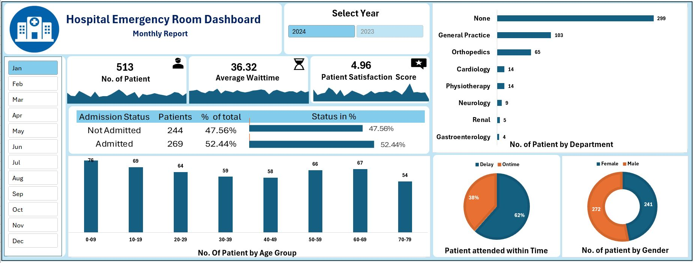

# Hospital Emergency Room Analysis Excel Project

## Overview

This project involves a comprehensive analysis of hospital emergency room data using Microsoft Excel. The analysis aims to extract meaningful insights to improve emergency room operations and patient care.

## Objectives

- Analyze patient demographics and visit details.
- Identify peak hours and days for emergency room visits.
- Determine common reasons for emergency visits.
- Assess patient wait times and service efficiency.

## Data Source

The dataset used in this project is titled `Hospital Emergency Room Raw_Data.csv`. It includes the following columns:

- `Patient_ID`: Unique identifier for each patient.
- `Visit_Date`: Date of the emergency room visit.
- `Visit_Time`: Time of the visit.
- `Age`: Age of the patient.
- `Gender`: Gender of the patient.
- `Reason_For_Visit`: Chief complaint or reason for the visit.
- `Wait_Time`: Time spent waiting before being attended to.
- `Treatment_Time`: Duration of the treatment.
- `Outcome`: Result of the visit (e.g., admitted, discharged).

## Data Cleaning and Preparation

The following steps were taken to prepare the data for analysis:

1. **Handling Missing Values**: Rows with missing `Patient_ID` or `Visit_Date` were removed. For other columns, missing values were handled appropriately based on the context.
2. **Data Type Conversion**: Ensured that `Visit_Date` and `Visit_Time` were in proper date and time formats, respectively.
3. **Creating New Columns**:
   - `Visit_Day`: Extracted the day of the week from `Visit_Date`.
   - `Visit_Hour`: Extracted the hour from `Visit_Time`.
  
## Dashboard

https://github.com/user-attachments/assets/248c46f8-1883-496e-9f9f-05d5511daafa

## Analysis and Insights

### 1. Patient Demographics

- **Age Distribution**: Created a histogram to visualize the distribution of patient ages.
- **Gender Distribution**: Calculated the percentage of male and female patients.

### 2. Visit Timing Analysis

- **Visits by Day**: Analyzed the number of visits for each day of the week to identify peak days.
- **Visits by Hour**: Analyzed the number of visits for each hour to identify peak hours.

### 3. Reasons for Visit

- **Common Complaints**: Created a bar chart to display the most common reasons for emergency room visits.

### 4. Wait Time Analysis

- **Average Wait Time**: Calculated the average wait time for patients.
- **Wait Time by Hour**: Analyzed how wait times varied throughout the day.

## Dashboard

An interactive dashboard was created in Excel to visualize the findings. The dashboard includes:

- Age and gender distribution charts.
- Heatmaps for visits by day and hour.
- Bar charts for common reasons for visits.
- Line charts showing trends in wait times.

## Conclusion

The analysis provided valuable insights into emergency room operations, including peak visit times, common patient demographics, and areas where wait times could be improved. These insights can help hospital administrators make informed decisions to enhance patient care and operational efficiency.

## Files in the Repository

- `Hospital Emergency Room Raw_Data.csv`: The raw dataset used for analysis.
- `Hospital_Emergency_Room Data.xlsx`: The Excel file containing the cleaned data and analysis.
- `Hospital_Emergency_Room_Dashboard.JPG`: Image of the Excel dashboard.
- `END TO END DASHBOARD PROJECT IN EXCEL.pptx`: Presentation detailing the project.

## How to Use

1. **Data Exploration**: Open `Hospital_Emergency_Room Data.xlsx` to explore the cleaned data and analysis.
2. **Dashboard Viewing**: Refer to `Hospital_Emergency_Room_Dashboard.JPG` to view the dashboard.
3. **Project Presentation**: Review `END TO END DASHBOARD PROJECT IN EXCEL.pptx` for a detailed walkthrough of the project.

